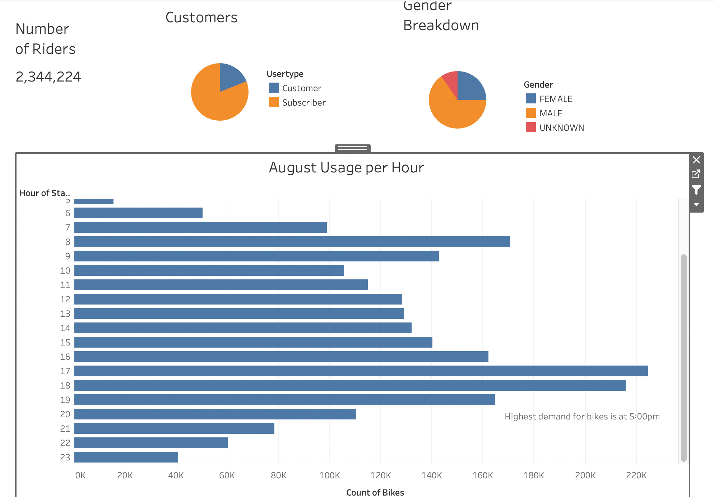
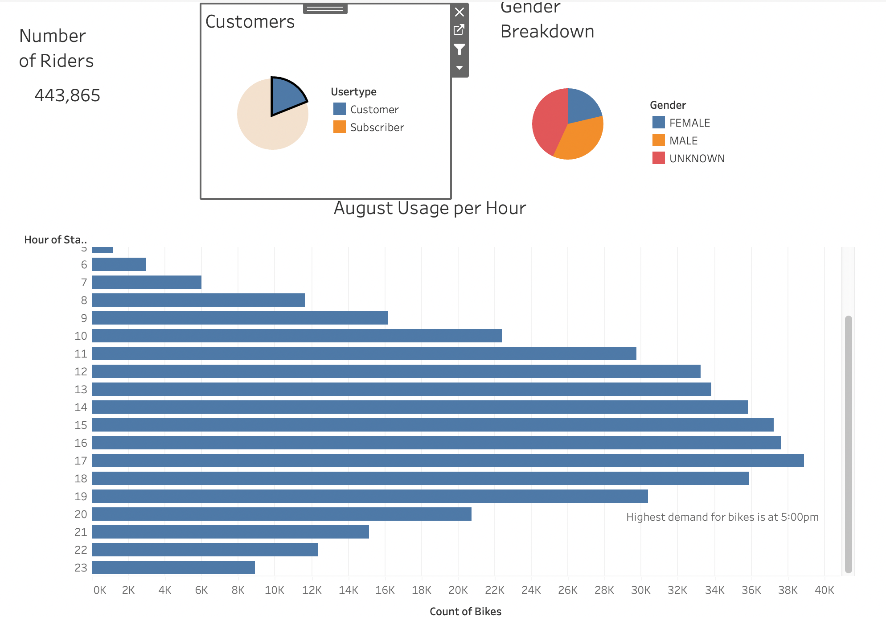
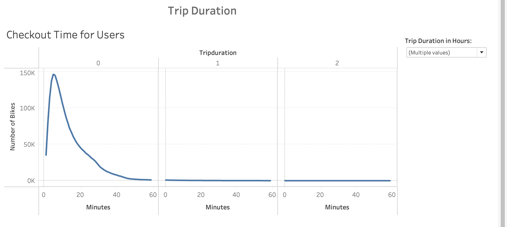
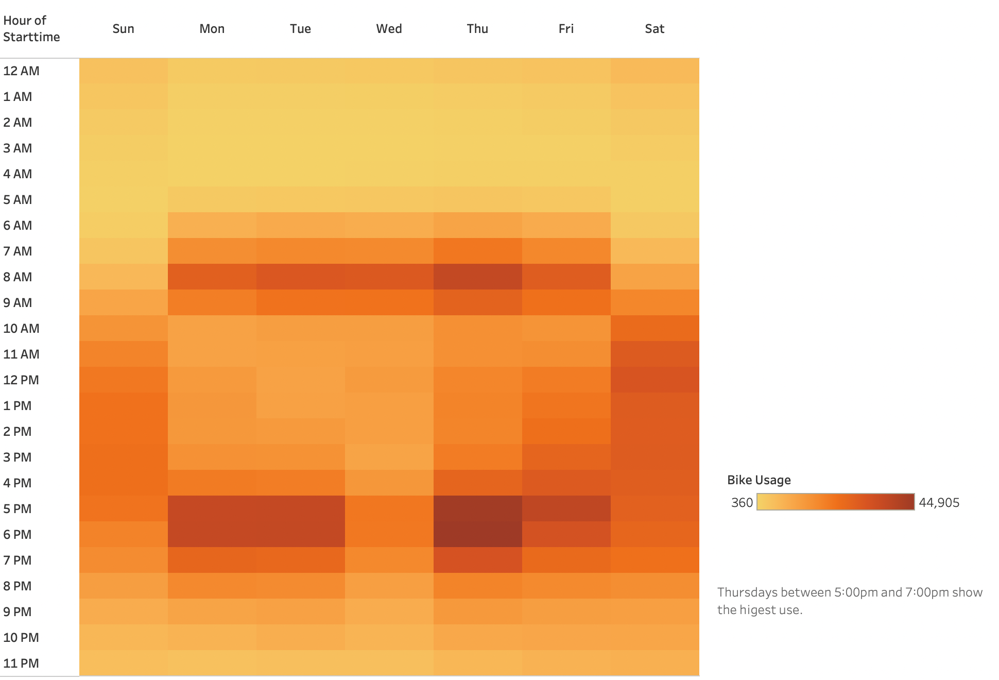
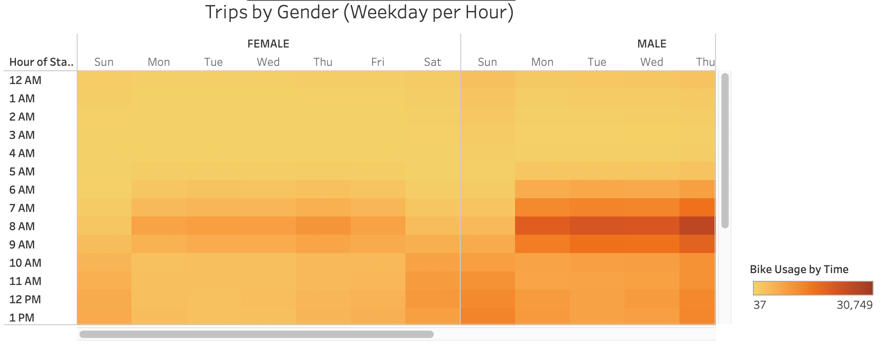
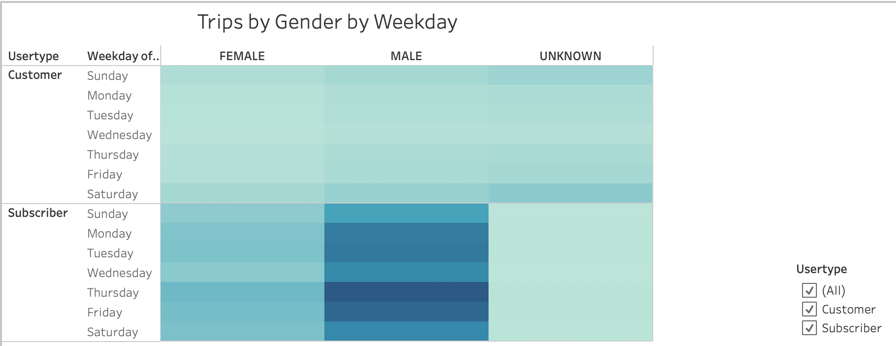

# Bikesharing - Bikes R Fun Story

## Overview of the Analysis

The purpose of this analysis is to examine a bike sharing business venture in Des Monies. The data for the analysis is from a bike sharing business in New York that shares many of the same business principles and models with our company. 

In this analysis, I centered our decision on the length of time that bikes are checked out, the number of bike trips for riders for each hour of each day of the week, and the number of bike trips for each user for each day of the week. The rest of the charts used in this analysis are described below. 

Furthermore, I used Pandas to manipulate the data so that it can be used accurately in our analysis. I processed, analyzed, and created visualizations for the data in Tableau Public. You can find this at the following website:

[Link to Storyboard](https://public.tableau.com/app/profile/alphonso.porras/viz/BikesRFunStory/BikesRFun)

## Results

In this chart, I showed the total number of people that used a bike sharing program in August. I broke it down by subscribers and non-subscribing customers and their self-reported gender. I broke it down further by using a bar graph to describe the usage per hour in August. This can be used to plan for repairs and when our bikes will be in greatest demand. The highest demand was at 5pm and 6pm. Additionally, 8am had the third highest use of bikes. 

For this field, I wanted to demonstrate the interact-ability of the page. One can click any pie graph, for example, and the other charts will filter for that selected action. Likewise, one can highlight any time period in the bar graph and the other graphs will adjust their totals to adjust for the selected time period. I invite you to try this on our own and see the different breakdown of results. 

During our analysis, I began to understand that most of our bikes were used, or checked out, for a total of no more than about 10 minutes. Additionally, I wanted to give the option for anyone to see how many users checkout our bikes for as many hours in the day; so, I created a filter for anyone to select 24 hours of a bike being checkout and broke that down by 20 minute increments. In other words, the top of the graph, trip duration, is sectioned in hours and the bottom portion shows increments of 20 minutes within each section. The results showed that 146,752 bikes are used for 0 hours and 5 minutes. While, 33 bikes are used for 2 hours and 59 minutes. So, our bikes have huge turnover with quick short bursts of movement. 

This chart is a heatmap - the greater the usage of bikes, the darker the color. It is plotted by days of the week - Sunday thru Saturday. And also plotted against time - midnight thru 11:59PM. The busy time would be during regular working hours - Monday thru Thursday from 8:00am till 7:00pm. And the busiest time would be after work from 5:00pm till 7:00pm. 

This chart is also a heatmap. However, for this chart, I explored gender throughout days of the week, Sunday thru Saturday, and over the entire day, 24 hours. As you can see, the greatest use is among males between Monday thru Thursday from 5:00pm thru 7:00pm. Females mirrored the results of their male counterparts to a lesser degree. 

In this chart, I focused on type of customer, subscriber or non-subscriber. For each of these user types, males used the bikes more often and male subscribers used the bikes most often. There is a small group of non-subscribing customers that did not identify their gender that used the bikes more often than any other user type on Saturdays. These non-identified non-subscribing users are probably tourists having a great time exploring the city on our bikes on their weekend. 

## Summary

As you can see from the results, our busiest time of day is between 5-7pm with Thursday being the busiest day of the week. Additionally, most of our customers are male subscribers. Our data also shows that our slowest time is between 1-4am, Monday-Friday. This would be a perfect time to perform preventative maintenance on the bikes and ensure they are working in proper condition. 

I suggest two additional visualizations for future analysis. One would look at the profit margins and future projections for businesses of similar style and function. And the second would extend out the analysis past the one month of August and look at the entire year. Another interesting point would be to compare and contrast the demographics between New York and Des Monies. This would ensure that any dissimilarities between the two cities could be address and taken into our business plan. 